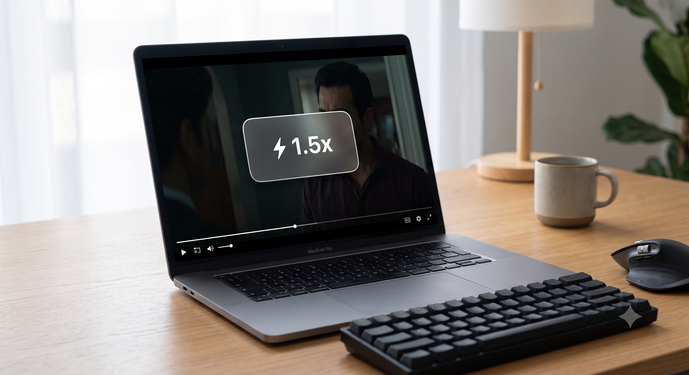

<div align="center">

# Safari Video Speed HUD

A lightweight, zero-extension macOS utility to control video playback speed across streaming platforms with a native glassmorphic HUD.


<br/>



</div>

---

## Overview

Many streaming platforms (such as JioHotstar, Prime Video, and certain OTT web players) lack native playback speed controls or restrict player adjustments. 

**Safari Video Speed HUD** provides keyboard-driven playback control by hooking into Safari's underlying HTML5 media elements via AppleScript and the Shortcuts app. It introduces a centered, frosted-glass HUD badge that provides instantaneous feedback during full-screen playback.

### Highlights
- **Zero Extensions Required:** Built purely on native macOS Shortcuts and AppleScript.
- **Glassmorphic On-Screen HUD:** Centered, auto-fading status card displaying real-time speed.
- **Granular Speed Steps:** `0.5x`, `0.75x`, `1.0x`, `1.25x`, `1.5x`, `1.75x`, `2.0x`, `2.5x`.
- **Full-Screen Friendly:** Operates smoothly over fullscreen HTML5 video layers.

---

## Prerequisites

Safari requires permission to execute JavaScript sent via external Apple Events:

1. Open **Safari**.
2. Go to **Settings** (`Cmd + ,`) > **Advanced**.
3. Check **"Show features for web developers"** (or *Show Develop menu in menu bar*).
4. From the macOS menu bar, navigate to **Develop** and enable **Allow JavaScript from Apple Events**.

---

## Installation

### Option 1: Import Pre-built Shortcuts (Quickest)
1. Clone this repository or download the ZIP:
   ```bash
   git clone [https://github.com/vinayak-hariharno/safari-video-speed-hud.git](https://github.com/vinayak-hariharno/safari-video-speed-hud.git)
